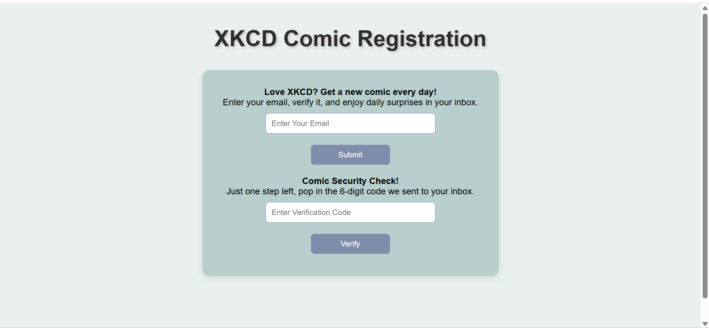
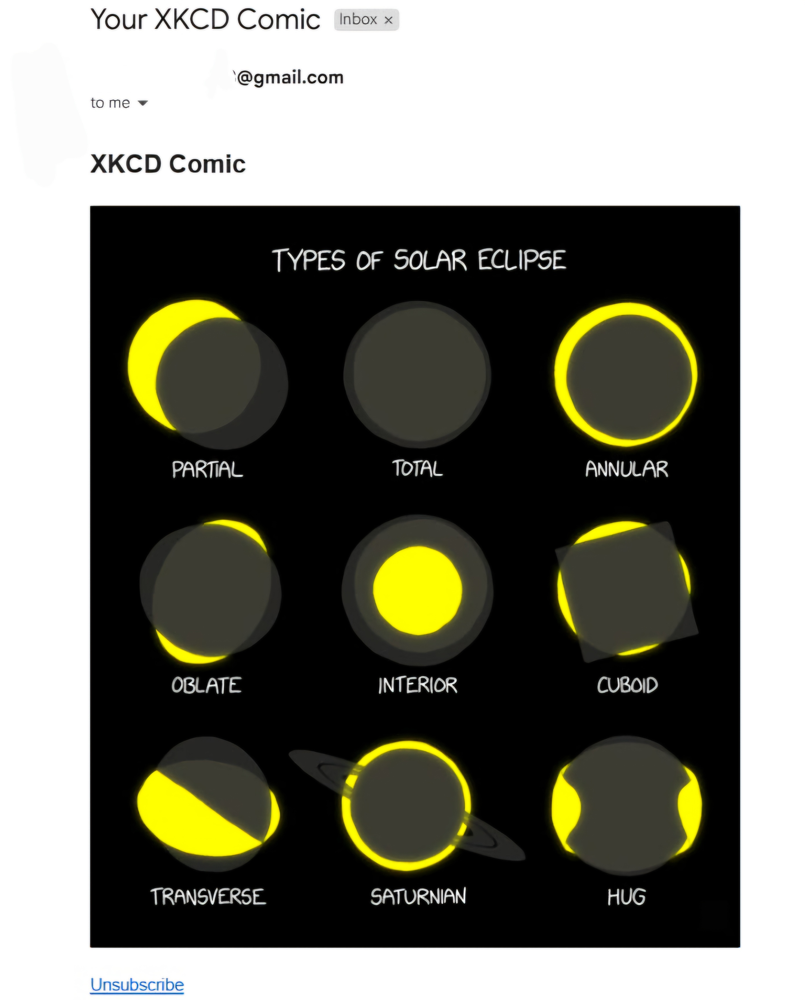
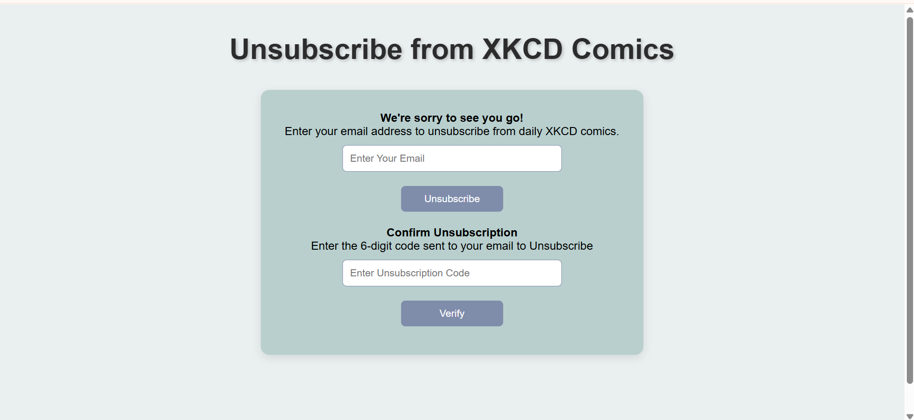

# XKCD Comic Subscription System 📬🎨

This project is a PHP-based email verification and XKCD comic subscription system. It allows users to subscribe using their email, receive a verification code, and get daily XKCD comics delivered to their inbox. Users can also unsubscribe at any time.

## 🛠️ Features

- ✅ **Email Registration with Verification**
  - Users enter their email and receive a verification code.
  - Verification handled in `index.php`.

- 📄 **Email Data Handling**
  - Registered emails are saved in `registered_emails.txt`.
  - No hardcoded emails used.

- ⚙️ **Modular Logic**
  - All core functionality is handled in `functions.php`.

- ⏰ **Daily XKCD Comic Delivery**
  - A CRON job configured using `setup_cron.sh` sends a random XKCD comic every 24 hours to verified users.

- ❌ **Unsubscribe Functionality**
  - Users can unsubscribe using a link containing their email.
  - Unsubscription handled via `unsubscribe.php` and email confirmation.

## 🖼️ Website Preview

### ✅ Subscription Page

### 📧 Comic Mail Sent

### ❌ Unsubscribe Page

